### Reading the data


```{r}
library("survival")
data(stanford2)
head(stanford2)

```
### Making a factor variable related to the Age > 40

```{r}

heart <- subset(stanford2, t5 != "NA")
Over40 <- ifelse(heart$age > 40,1,0)
heart <- cbind(heart, Over40)


```

### Making a factor variable related to T5 mismatchlevel 0,1,2


```{r}
len <- length(heart$t5)

misMatchLevel <- rep(0,len)

for (i in 1:len){
  
  if (heart$t5[i] > max(heart$t5)/3*2){
    
    misMatchLevel[i] <- 2
    
  }else if(heart$t5[i] > max(heart$t5)/3) {
    
    misMatchLevel[i] <- 1
  }
  
}

heart <- cbind(heart, misMatchLevel)

heart$misMatchLevel <- as.factor(heart$misMatchLevel)

```

### summary of the data

```{r}
summary(heart)
```
### Comparing KM curves

```{r}
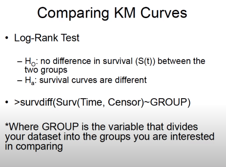
```

```{r}
longrank <- survdiff(Surv(heart$time,heart$status)~ heart$Over40)
longrank
```
como el valor de la p < 0.05, se rechaza la hipotesis nula, entonce hay evidencia para decir que las 2 funciones de supervivencia son difrentes para los 2 grupos de edad ignorando cualquier otro factor

```{r}
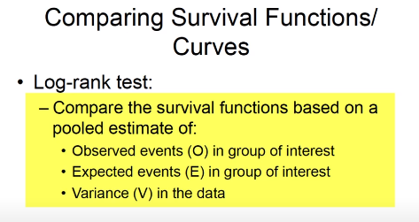
```

```{r}
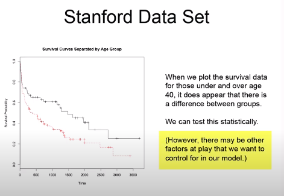
```

```{r}
ekm <- survfit(Surv(heart$time,heart$status)~ heart$Over40)
plot(ekm)
```

```{r}
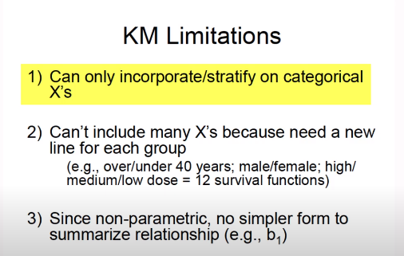
```


```{r}
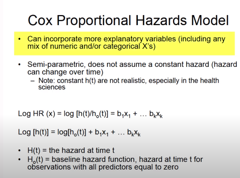
```
No se sabe el valor de la linea base, no se puede calcular el hazard de un individuo en un punto particular porque no tenemos ese valor

```{r}
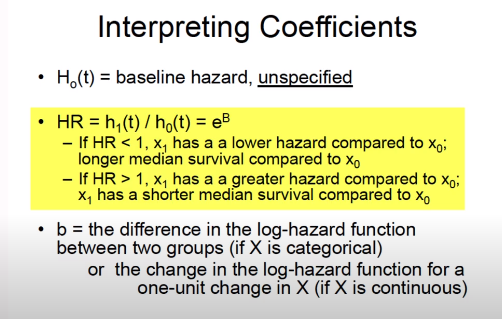
```

```{r}
cox <- coxph(Surv(heart$time,heart$status) ~ heart$Over40)
summary(cox)
```
En un isntante datado, el logaritmo del riesgo instantaneo de muerte es 0.52 mas alto para los mayores de 40 que para lo menos a esa edad.


```{r}
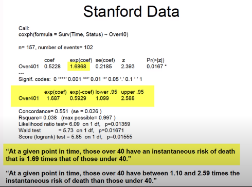
```

el harzard ratio es el exponente del coef en este caso 1.69, ignorando cualquier otra variable

```{r}
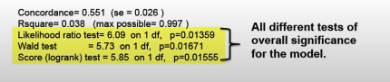
```

los test nos muestran que todos nuestro modelos los B no son iguales a 0, nuestro modelo esstastitic with linear regression, todos son mnor a 0.05

```{r}
cox2 <- coxph(Surv(heart$time,heart$status) ~ heart$Over40 +heart$misMatchLevel)
summary(cox2)
```

como hay poco variacaion en el coeficiente y en el SE de Over, podemos decir que OVer40 no es una variable explicatoria, al igual que mistach tampoco cambia mucho, no actua como cofunder pues el coeficiente OVer40 no disminuye y no como un predictor pues el SE de OVer tampoc lo hace


```{r}
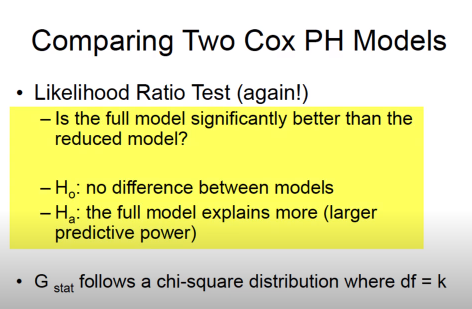
```
```{r}
anova(cox, cox2, test = "LRT")
```
Puesto que el p-values 0.1998 > que 0.05, no se rechaza H0, por lo tanto el modelo que incluye mimatch no es mejor que el modelo mas simple


```{r}
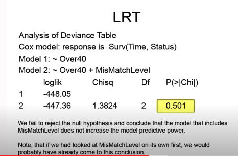
```

NOTA: cuando p < 0.05, y la variable no es un cofounder, mismatch es un predictor significativo, pero no esta mejorando el cofunding entre x, y, es decir que mithmasth solo nos esta ayudando a ser un mejor predictor, si solo estamos interesados en lso verdaderos confundadores debemos tener encuenta estos efectos 
```{r}
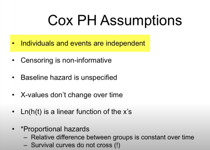
```


El hazard es constante

```{r}
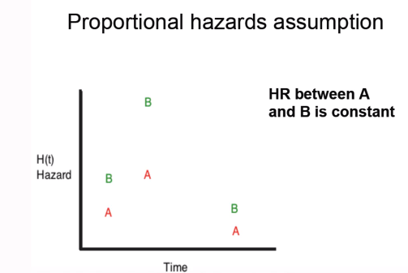
```
```{r}
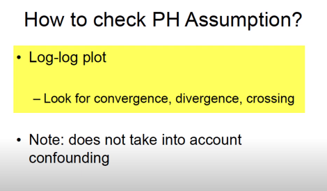
```
```{r}
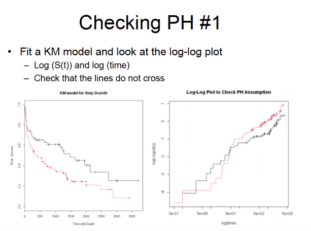
```
Cuando se cruzan no es apropiado utilizar el COX PH

```{r}
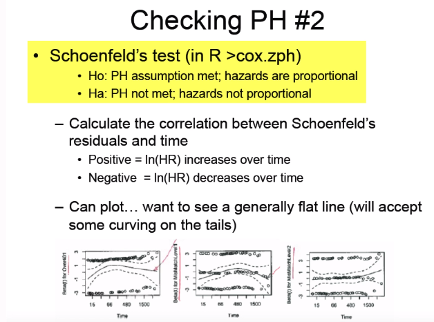
```

Se epera ver una linea en el centro pero es aceptable ver un pequeña desviacion
```{r}
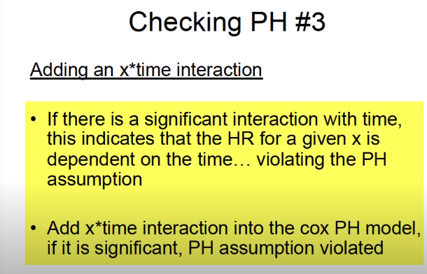
````

```{r}
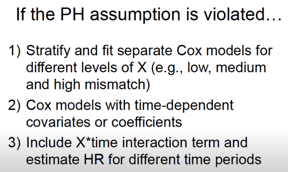
````

```{r}
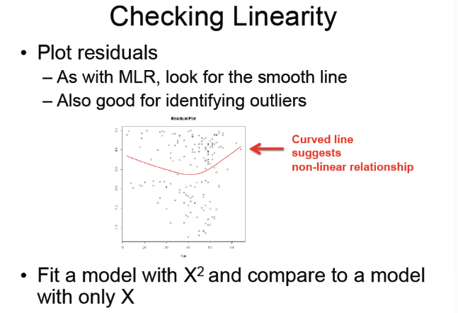
````