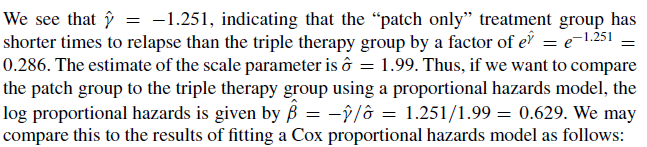
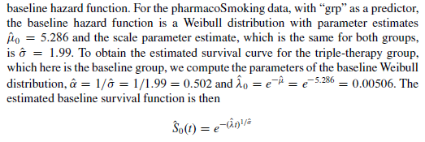
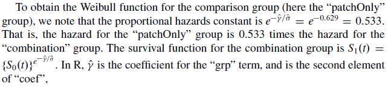
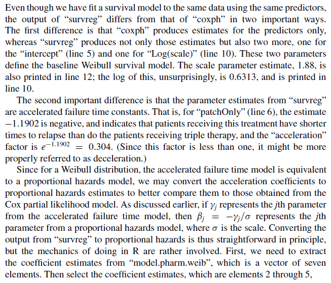

```{r}
library(asaur)
library(survival)
data("gastricXelox")

```

### 10.3 TheWeibull Model

10.3.1 Assessing the Weibull Distribution as a Model for Survival Data in a Single Sample

```{r}

### First we must calculted the KM model estimate of the survival distibution

timeMonths <- gastricXelox$timeWeeks*7/30.25
delta <- gastricXelox$delta
result.km <- survfit(Surv(timeMonths, delta) ~ 1)
```

Next we extract the survival estimates and time variables from “result.km” and transform the former with a complementary log-log transformation, and the latter with a log transformation,

```{r}

survEst <- result.km$surv
survTime <- result.km$time
logLogSurvEst <- log(-log(survEst))
logSurvTime <- log(survTime)

```

Finally, we plot “logLogSurvEst” versus “logSurvTime” and fit a straight line
through the points

```{r}
plot(logLogSurvEst ~ logSurvTime)
result.lm <- lm(logLogSurvEst ~ logSurvTime)
abline(result.lm)
```
Note: The results, shown in Fig. 10.1, indicate that a Weibull distribution may not be appropriate for these data, since the points do not follow a linear relationship.

```{r}

data(pharmacoSmoking)

```

```{r}
ttr <- pharmacoSmoking$ttr
relapse <- pharmacoSmoking$relapse

## Redifining ttr values

ttr[ttr == 0] <- 0.5

```

We then fit a fit a Kaplan-Meier survival curve to the data, and extract the survival and corresponding event times.

```{r}

result.surv <- survfit(Surv(ttr, relapse) ~ 1)
survEst <- result.surv$surv
survTime <- result.surv$time

```

Then we compute a complementary log-log transformation of the survival times
and a log transformation of the corresponding event times

```{r}

logLogSurvEst <- log(-log(survEst))
logSurvTime <- log(survTime)
result.lm <- lm(logLogSurvEst ~ logSurvTime)
result.lm

```

```{r}
plot(logLogSurvEst ~ logSurvTime)
abline(result.lm)
```
Estimates of the scale and mean parameters are
u=-b/m = 2.0032/0.4385= 4.568 
and 
sigma = 1/m = 1/0.4385 =2.280.

### 10.3.2 Maximum Likelihood Estimation of Weibull Parameters for a Single Group of Survival Data

```{r}
### LogLikWiib

logLikWeib <- function(par, tt, status) {
mu <- par[1]
sigma <- par[2]
lambda.p <- exp(-mu)
alpha.p <- 1/sigma
dd <- sum(status)
sum.t <- sum(status*log(tt))
sum.t.alpha <- sum(tt^alpha.p)
term.1 <- dd*log(alpha.p) + alpha.p*dd*log(lambda.p)
term.2 <- (alpha.p - 1)*sum.t
term.3 <- (lambda.p^alpha.p)*sum.t.alpha
result <- term.1 + term.2 - term.3
result
}
```

The m.l.e may be obtained using the “optim” function, using as starting values the estimates of "u" and "sigma" from the linear regression,

```{r}
result <- optim(par=c(4.568, 2.280), fn=logLikWeib, method="L-BFGS-B", lower=c(0.001, 0.01), upper=c(5, 5), control=list(fnscale = -1),
tt=ttr, status=relapse)
```

As always, we use the option “control=list(fnscale = -1)” to tell the optim function
to find a maximum (rather than a minimum). The final m.l.e. is given by

```{r}
result$par

```
The first element of “result$par” is "u" and the second element is "sigma" . A more practical
way to obtain these estimates is by means of the function “survreg” in the “survival”
package, which of course yields the same parameter estimates:

```{r}
result.survreg.0 <- survreg(Surv(ttr, relapse) ~ 1, dist="weibull")
```

```{r}
summary(result.survreg.0)
```

The m.l.e. of the scale parameter, 2.04, is close to the value 2.28 from the linear
regression approach. The “Intercept” m.l.e., 4.656, is approximately the value 4.57
we obtained from the linear regression. The estimate “Log(scale)” is, of course, the
log of the scale parameter.

### 10.3.4 Selecting a Weibull Distribution to Model Survival Data

To find a Weibull distribution that matches the survival data at two specified time points.

Kaplan-Meier estimate of the survival distribution for
the “patchOnly” group at 4 and 12 weeks (28 and 84 days),In R, we first find the Kaplan-Meier estimate, which is in “result.surv”, and then find the survival estimates at times 28 and 84 days, which we put into “result.summ”

```{r}

grp <- pharmacoSmoking$grp
result.surv <- survfit(Surv(ttr, relapse) ~ 1, subset={grp =="patchOnly"})
result.summ <- summary(result.surv, time=c(28, 84))
t.vec <- result.summ$time
s.vec <- result.summ$surv
data.frame(t.vec, s.vec)

```
Next, we use the “Weibull2” function in F. Harrell’s “Hmisc” package to produce a
Weibull function that matches these two points,

```{r}

library(Hmisc)
library(ggplot2)
pharmWeib <- Weibull2(t.vec, s.vec)

```

The function “pharmWeib” computes the Weibull survival estimates for a range of
time values,

```{r}
t.vals <- 1:200
s.vals <- pharmWeib(t.vals)
```

(The internal parametrization used by the “Weibull2” function is different fromwhat
we use in this book, but this doesn’t matter, since of course it produces the same
survival estimates.)
Next, let us obtain the predicted Weibull survival curve based on maximum
likelihood estimates of the Weibull parameters.

```{r}
model.pharm.weib.basic <- survreg(Surv(ttr, relapse) ~ 1,
dist="weibull", subset={grp =="patchOnly"} )
mu.hat <- model.pharm.weib.basic$coefficients
sigma.hat <- model.pharm.weib.basic$scale
lambda.hat <- exp(-mu.hat) # " 1 / scale"
alpha.hat <- 1/sigma.hat # "shape"
s.mle.vals <- 1 - pweibull(t.vals, shape=alpha.hat,
scale=1/lambda.hat)
```

Finally, we plot the survival estimates in Fig.

```{r}
plot(result.surv, conf.int=F, xlab="Days to relapse",
ylab="Survival probability")
lines(s.mle.vals ~ t.vals, col="blue")
lines(s.vals ~ t.vals, col="red")
points(t.vec, s.vec, col="red")
```

### 10.3.5 Comparing Two Weibull Distributions Using the Accelerated Failure Time and Proportional Hazards Models

The pharmacoSmoking data, comparing the triple therapy treatment group to the
patch treatment provides an illustration of these principles. TheWeibull model may
be used to compare the two groups as follows, using the “survreg” function in the
survival package:

```{r}
result.survreg.grp <- survreg(Surv(ttr, relapse) ~ grp, dist="weibull")
summary(result.survreg.grp)
```
```{r}


```

```{r}
result.coxph.grp <- coxph(Surv(ttr, relapse) ~ grp)
summary(result.coxph.grp)
```

```{r}

```


We may obtain the baseline Weibull coefficient estimates in R as follows:

```{r}
mu0.hat <- result.survreg.grp$coef[1]
sigma.hat <- result.survreg.grp$scale
alpha.hat <- 1/sigma.hat
lambda0.hat <- exp(-mu0.hat)
```

From these we compute the baseline survival function,
```{r}
tt.vec <- 0:182
surv0.vec <- 1 - pweibull(tt.vec, shape=alpha.hat , scale=1/lambda0.hat)
```

```{r}

```

```{r}
gamma.hat <- result.survreg.grp$coef[2]
surv1.vec <- surv0.vec^(exp(-gamma.hat/sigma.hat))
```

It is helpful to compare these survival estimates to those from the Cox proportional
hazards model. The latter survival estimates are obtained as follows:

```{r}
coxph.surv.est <- survfit(result.coxph.grp,
newdata=data.frame(list(grp=c("combination","patchOnly"))))
```

It is helpful to compare these survival estimates to those from the Cox proportional
hazards model. The latter survival estimates are obtained as follows:

```{r}
coxph.surv.est <- survfit(result.coxph.grp,
newdata=data.frame(list(grp=c("combination","patchOnly"))))
```
In the call to “survfit”, we have created a data frame for the “grp” variable, and
use that data along with the results of the Cox proportional hazards model to obtain
the predicted survival curves. We may plot the Cox-based survival curves and the
Weibull-based survival curves on the same plot,


```{r}
plot(coxph.surv.est, col=c("red", "black"))
lines(surv0.vec ~ tt.vec, col="red")
lines(surv1.vec ~ tt.vec)
```
### 10.3.7 Using the Weibull Distribution to Model Survival Data with Multiple Covariates

```{r}
age <- pharmacoSmoking$age
employment <- pharmacoSmoking$employment
model.pharm.coxph <- coxph(Surv(ttr, relapse) ~ grp + age + employment)
summary(model.pharm.coxph)
```
We may include these covariates in a Weibull model
as follows:

```{r}
model.pharm.weib <- survreg(Surv(ttr, relapse) ~ grp + age  + employment, dist="weibull")
summary(model.pharm.weib)
```
```{r}

```
```{r}
weib.coef.all <- model.pharm.weib$coef
weib.coef <- weib.coef.all[2:5]
```

To get the proportional hazards estimates, we need to extract the estimate of the
scale factor, “model.pharm.weib$scale”, and then switch the sign, and divide,

```{r}
weib.coef.ph <- -weib.coef/model.pharm.weib$scale
```
The vector “weib.coef.ph” contains the proportional hazards parameter estimates from the Weibull model.

Extracting the coefficients from the Cox (partial likelihood) model is somewhat
simpler,
```{r}
coxph.coef <- model.pharm.coxph$coef
```

We may use the “data.frame” function to assemble the estimates and standard errors in a table as follows:

```{r}
data.frame(weib.coef.ph, coxph.coef)
```
### 10.3.8 Model Selection and Residual Analysis with Weibull Survival Data

Many of the facilities for model selection and residual analysis that we discussed
in Chaps. 6 and 7 may also be used with Weibull modeling of survival data.
For example, we may fit a model with all covariates as predictors, and then use
backwards stepwise regression, using the AIC as a measure of goodness of fit, as
follows:
```{r}
yearsSmoking <- pharmacoSmoking$yearsSmoking
levelSmoking <- pharmacoSmoking$levelSmoking
priorAttempts <- pharmacoSmoking$priorAttempts
longestNoSmoke <- pharmacoSmoking$longestNoSmoke
race <- pharmacoSmoking$race
gender <- pharmacoSmoking$gender

modelAll.pharm.weib <- survreg(Surv(ttr, relapse) ~ grp + gender + race + employment + yearsSmoking + levelSmoking + age + priorAttempts + longestNoSmoke, dist="weibull")

model.step.pharm.weib <- step(modelAll.pharm.weib)
```
The resulting model, with “grp”, “age”, and “employment”, is the same as we
discussed in the previous section. We may also use the “residuals” function to
compute deviance residuals and deletion residuals,

```{r}
smoothSEcurve <- function(yy, xx) {
# use after a call to "plot"
# fit a lowess curve and 95% confidence interval curve
# make list of x values
xx.list <- min(xx) + ((0:100)/100)*(max(xx) - min(xx))
# Then fit loess function through the points (xx, yy)
# at the listed values
yy.xx <- predict(loess(yy ~ xx), se=T,
newdata=data.frame(xx=xx.list))
lines(yy.xx$fit ~ xx.list, lwd=2)
lines(yy.xx$fit -
qt(0.975, yy.xx$df)*yy.xx$se.fit ~ xx.list, lty=2)
lines(yy.xx$fit +
qt(0.975, yy.xx$df)*yy.xx$se.fit ~ xx.list, lty=2)
}
```

The resulting model, with “grp”, “age”, and “employment”, is the same as we
discussed in the previous section. We may also use the “residuals” function to
compute deviance residuals and deletion residuals,

```{r}

resid.deviance <- residuals(model.pharm.weib, type="deviance")
par(mfrow=c(2,2))
plot(resid.deviance ~ age)
smoothSEcurve(resid.deviance, age)
title("Deviance residuals\nversus age")

plot(resid.deviance ~ grp)
title("Deviance residuals\nversus treatment group")

plot(resid.deviance ~ employment)
title("Deviance residuals\nversus employment")

```

