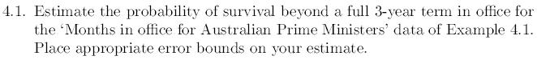

```{r}



```

#### Required data

```{r}

## Months in office for Australian Prime Ministers

ministers <- c(seq(1:29))
months <- c(33,8,5,12,41,8,11,39,16,14,89,81,28,88,1,29,3,46,1,54,194,24,2,39,22,36,89,106,52)

```

#### Plotting position calculations

```{r}
## Plotting position

p = (ministers - 0.5)/length(ministers)

```

#### Data Plot

```{r}
## Empirical survivor plot

months <- sort(months)
data <- as.data.frame(cbind(months,1-p))
plot(months,1-p, main="Empirical Survival Function", xlab = "Months in office", ylab = "Survival Probability")

```
#### Estimate probablity of survival beyond full 3 years 

Knowing that the estimate probability of the survival fucntion is giving by

$$S_n\left(y\right)=\frac{number\:of\:observations\:>y}{n}=\frac{1}{n}\sum _{i=1}^n\:I\left(y,\infty \right)\left(Y_i\right)$$

then:

$$S_{29}\left(12\right)=\frac{1}{29}\sum _{i=1}^n\:I\left(12,\infty \right)\left(Y_i\right)=\frac{12}{29}\:=\:0.4137$$
#### Confidence interval

And the approximate confidence interval based in two standard error is:

$$S_{29}\left(12\right)\frac{+}{ }2\sqrt{\frac{S_{29}\left(12\right)\left(1-S_{29}\left(12\right)\right)}{n}}$$

then

$$0.4137+2\sqrt{\frac{0.4137\left(1-0.4137\right)}{29}}=0.5966$$


and

$$0.4137-2\sqrt{\frac{0.4137\left(1-0.4137\right)}{29}}=0.2308$$

