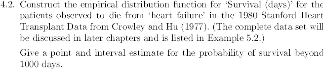

### Required libraries
```{r}

```

```{r}

knitr::include_graphics("4_1.PNG")

```

### Required data

To facilitate the calculations, we will plot the empirical survival function, first creating the vectors that store the data.

```{r}

## Months in office for Australian Prime Ministers

ministers <- c(seq(1:29))
months <- c(33,8,5,12,41,8,11,39,16,14,89,81,28,88,1,29,3,46,1,54,194,24,2,39,22,36,89,106,52)

```

### Plotting position calculations

```{r}
## Plotting position

p <- (ministers - 0.5)/length(ministers)
head(p)
```

### Data Plot

```{r}
## Empirical survivor plot

months <- sort(months)
data <- as.data.frame(cbind(months,1-p))
plot(months,1-p, main="Empirical Survival Function", xlab = "Months in office", ylab = "Survival Probability", col ="red")

```


### Estimate probablity of survival beyond full 3 years 

Knowing that the estimate probability of the survival fucntion is giving by:

$$S_n\left(y\right)=\frac{number\:of\:observations\:>y}{n}=\frac{1}{n}\sum _{i=1}^n\:I\left(y,\infty \right)\left(Y_i\right)$$

then:

$$S_{29}\left(36\right)=\frac{1}{29}\sum _{i=1}^n\:I\left(36,\infty \right)\left(Y_i\right)=\frac{12}{29}\:=\:0.4137$$
### Confidence interval


And the approximate confidence interval based in two standard error is:

$$S_{29}\left(17\right)\frac{+}{ }2\sqrt{\frac{S_{29}\left(17\right)\left(1-S_{29}\left(17\right)\right)}{29}}$$

then

$$0.4137+2\sqrt{\frac{0.4137\left(1-0.4137\right)}{29}}=0.5966$$


and

$$0.4137-2\sqrt{\frac{0.4137\left(1-0.4137\right)}{29}}=0.2308$$

```{r}



```

### Required data

```{r}
## Stanford Heart Transplat Data

## Reading data
heart <- read.csv("heart_data.csv", header=T,sep=";")
attach(heart)
head(heart)

```

### Plotting position calculations

```{r}

## Plotting position

patients <- seq(1:length(Days))
p <- (patients - 0.5)/length(patients)
head(p)

```

### Data Plot

```{r}
## Empirical survivor plot

i <- order(heart$Days)
heart <- heart[i,]
p <- 1-p

Days <- heart$Days
Cens <- heart$Cens

newHeart <- as.data.frame(cbind(Days,Cens,p))
newHeart <- subset(newHeart, Cens==1)
plot(newHeart$Days,newHeart$p, main="Empirical S(t) Heart transplant", xlab = "
Days since heart transplant", ylab = "Survival Probability", col="red")

```

### Estimate probablity of survival beyond 1000 days

```{r}
## Looking on the data greater than 1000

sum(heart$Days > 1000)

```

Then by the definition 1.3:

$$S_{69}\left(1000\right)=\frac{1}{69}\sum \:_{i=1}^{69}\:I\left(1000,\infty \:\right)\left(Y_i\right)=\frac{8}{69}=0.1159$$

#### Confidence interval

The approximate confidence interval based in two standard error is:

$$0.1159+2\sqrt{\frac{0.1159\left(1-0.1159\right)}{69}}=0.1929$$
and

$$0.1159-2\sqrt{\frac{0.1159\left(1-0.1159\right)}{69}}=0.0388$$
```{r}

knitr::include_graphics("4_3.PNG")

```
### Calculation of the empirical and accumulative Hazard

```{r}


k <- seq(69,1)
Emp.h <- c()
Days <- heart$Days 
Cens <- heart$Cens

### The following cycles calculate all the data for the empirical risk, for ease of calculation the censored data are filled with zeros.


for(i in 1:69){
  
  if(Cens[i] == 0){
    
    Emp.h[i]= 0

    
  }else{
    
    Emp.h[i] = 1/k[i]

  }
  
}

cum.H <- cumsum(Emp.h)

for(i in 1:69){
  
  if(Cens[i] == 0){
    
    cum.H[i]= 0

  }
}


harzard.score<- as.data.frame(cbind(Days,Cens, k, Emp.h, cum.H))

head(harzard.score)
```

### Building the Empirical harzard plot

```{r}

### Building the graph

hz.plotting <- subset(harzard.score, Cens == 1)
plot(hz.plotting$Days,hz.plotting$Emp.h, main="Empirical Hazard Plot", xlab = "Days since heart transplant", ylab = "Hazard plot score", col="red")
```

```{r}

knitr::include_graphics("4_3_1.PNG")

```

```{r}

### Estimated accrued risk at 1,000 days, the closest point is 994 days.

hz.plotting$cum.H[hz.plotting$Days == 994]

```


Based on the calculations in the table above, we can say that the accumulated empirical hazard at 1000 days is 1.2918.


```{r}


```
### Calculations of lognormal probability distribution

```{r}

inv_phi <- qnorm(newHeart$p)
result.lm <- lm(inv_phi~log(newHeart$Days))

plot(log(newHeart$Days),inv_phi, main = "Lognormal probability distribution for heart transplant",xlab="log(Days)", sub="log-normal",ylab=expression(Phi^-1 * (S(t))))
abline(result.lm, col="red")

result.lm
```
Using the graph as empirical evidence, it can be corroborated that the data are generated to fit a lognormal distribution( 2.4423 , -0.4948 ).

### Accumulated hazard calculations

Similarly, we can calculate the cumulative hazard for a log normal distribution as follows:

```{r}
Hexp <- 1-exp(-hz.plotting$cum.H)
Hphi <- qnorm(Hexp)

LogNomrh.lm <- lm(Hphi~log(hz.plotting$Days))

plot(log(hz.plotting$Days),Hphi, main="Accumulated log−normal Hazard", ylab = "Accumulated log−normal Hazard", xlab="log(Days)", xlim=c(0,7), ylim=c(-2.2,1) )
abline(LogNomrh.lm, col="red")

```


```{r}


```
In our case the author has decided to use b = 0.5, as can be seen below:


$$100\left(\frac{i-b}{n+1-2b}\right)=100\left(\frac{i-\frac{1}{2}}{n+1-2\left(\frac{1}{2}\right)}\right)=100\left(\frac{i-\frac{1}{2}}{n}\right)$$