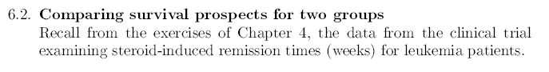
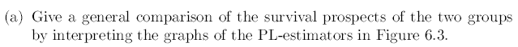
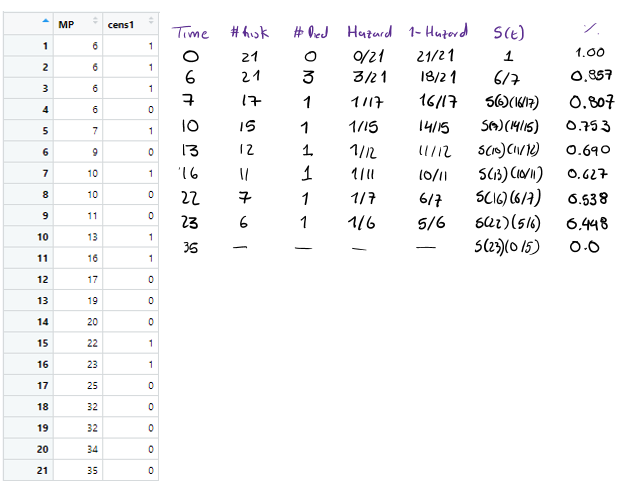
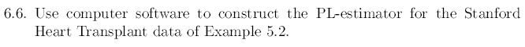

### Required libraries

```{r}

library(survival)
```

```{r}



```

### Required data

```{r}

### Patients whowere given 6-mercaptopurine
### The time for 6-MP and the placebo time were given in weeks

MP <- c(6,6,6,6,7,9,10,10,11,13,16,17,19,20,22,23,25,32,32,34,35)
cens1 <- c(1,1,1,0,1,0,1,0,0,1,1,0,0,0,1,1,0,0,0,0,0)

### Patients who were given Placebo

placebo <- c(1,1,2,2,3,4,4,5,5,8,8,8,8,11,11,12,12,15,17,22,23)
cens2 <- rep(1,21)
  
```

### Joining the Data

```{r}

### Joining the MP and placebo data in the same vector 

Total <- c(MP,placebo)

### Converting the given times to months by dividing the number of weeks/4.345

Total <- Total/4.345

### Joining the MP and placebo censored data in the same vector 

cens <- c(cens1, cens2)

### Creating data groups MP = 1, Placebo = 0

groups <- c(rep(1,21),rep(0,21)) 

```

### PL-Estimator

```{r}

### Calculating the PL estimator using the survival library

km.model <- survfit(Surv(Total,cens)~ groups)
```

### Comparation Chart

```{r}
plot(km.model, conf.int=F,col=c("red", "blue"), xlab = "Remission time (in months)", ylab = "S(t)", main="Comparing the survival time for the 2 groups", mark.time = TRUE, lwd = 2, las=1)
legend("topright", legend=c("6-MP","Placebo"), lty = 1, lwd = 2, col=c("blue", "red"), bty="n")

```

```{r}

```

From the analysis of the graphs, it can be seen that the time for the treatment group administered the 6-MP steroid to enter remission is longer than that of the patients administered the placebo. We can also see that the survival function for the treatment group is above that of the placebo group, clearly indicating that the efficacy of the 6-MP steroid, of course this is not the case at all times and the survival function for both groups is maintained at 100%, until the first week where both graphs are far apart, corroborating the effectiveness of the treatment because the risk of entering remission is lower.


```{r}
knitr::include_graphics("6_2_b.PNG")
```
Using the graphs for both groups we can estimate that the probability of survival, i.e. not entering remission after 3 months, for the treatment group is about 70%, while for the placebo group it is about 20%.

```{r}
knitr::include_graphics("6_2_c.PNG")
```
```{r}
### summary function on the KM model

summary(km.model)
```
Using the summary function on the kaplan-maier model, to calculate the estimated value of the survival function beyond 3 months, we have that for the group to which the treatment was administered it was 69%, while for the placebo group it was 19.05%.


```{r}
knitr::include_graphics("6_3.PNG")
```

To fill in the values of the PL- estimator for 6-MP group, we will use definition 6.3 to manually calculate the values as shown below.

```{r}
### Turning data into a DF

mpData <- as.data.frame(cbind(MP, cens1))
```

Manual calculation

```{r}


```


To verify the calculations performed we will calculate the KM estimator on the training group data only.


```{r}
km.modelMP <- survfit(Surv(MP,cens1)~ 1)
summary(km.modelMP)
```

As we can see the summary function shows that the manually calculated data match the data generated by the software.

```{r}



```


### Required data

```{r}
## Stanford Heart Transplat Data

## Reading data

heart <- read.csv("heart_data.csv", header=T,sep=";")
### Shows the first 5 rows
head(heart)
```

```{r}
### Data sorting based on the amount of days

i <- order(heart$Days)
heart <- heart[i,]

### Shows the first 5 rows from the sorted data

head(heart)
```
### PL- Estimator

```{r}

km.modelH <- survfit(Surv(heart$Days,heart$Cens)~1)

st <-km.modelH$surv
tekm <- km.modelH$time
inv_Phi <- qnorm(st)

```

### Graficando probabilidad
```{r}
plot(km.modelH, conf.int=T, xlab = "Time (Days)", ylab="% Alive = S(t)", main="KM-Model for Heart Transplat Patients")

summary(km.modelH)
```


```{r}

knitr::include_graphics("6_6_1.PNG")

```
Using the summary function, it is estimated that the probability that the patient will live for more than one year after transplantation is approximately 43%, with a estimate standar error of 0.0620

```{r}

knitr::include_graphics("6_6_2.PNG")

```

The probability of survival after 6 to the next 6 months after heart transplantation decreases based on the model calculated in this way and the probability of survival between months 7 to 12 is given respectively by the following:

```{r}
### Calculating the survival probability between the months 7 to 12

result.summ <- summary(km.modelH, time=c(seq(7,12)*30.417))
month <- (result.summ$time)/30.417
St <- result.summ$surv
data.frame(month, St)
```

