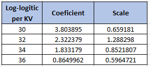

```{r}
library(survival)
```

```{r}
knitr::include_graphics("8_3.PNG")
```
```{r}
voltages <- read.csv("voltages.csv", header = T, sep = ",")
str(voltages)
```

```{r}
knitr::include_graphics("8_31.PNG")
```

```{r}
voltages$KV <- as.factor(voltages$K)
km.voltages <- survfit(Surv(time,cens)~KV, data=voltages)
summary(km.voltages)
```

```{r}

plot(km.voltages, conf.int=F,col=c("red", "blue", "green", "orange"), xlab = "Time to breakdown", ylab = "S(t)", main="Comparing the survival time for the Group of Voltages", mark.time = TRUE, lwd = 2, las=1)
legend("topright", legend=c("32KV","30KV","34KV","36KV"), lty = 1, lwd = 2, col=c("blue", "red", "green", "orange"), bty="n")
```
```{r}
St <- km.voltages$surv
logtime <- log(km.voltages$time)
weibull <- log(-log(St))
exponential <- -log(St)
lognormal <- qnorm(St)

voltages <- cbind(voltages,St,logtime,weibull,exponential,lognormal)
```


```{r}

par(mfrow = c(1,3))

### Weibull
plot(logtime[1:10],weibull[1:10],col="red", pch = 19 , ylab= "Weibull position", xlab="Log(Faliure time)", xlim=c(-2,6), ylim= c(-3,1.5), main = "Weibull")
points(logtime[12:25],weibull[12:25],col="blue", pch = 19)
points(logtime[27:44],weibull[27:44],col="green", pch = 19)
points(logtime[46:59],weibull[46:59],col="orange", pch = 19)
legend("bottomright", legend=c("30KV", "32KV", "34KV", "36KV"), col = c("red","blue","green","orange"), pch = 19, bty = "n")

### Exponential
plot(logtime[1:10],exponential[1:10],col="red", pch = 19 , ylab= "Exponential position", xlab="Log(Faliure time)", xlim=c(-2,6), ylim= c(0,3.2), main = "Exponential")
points(logtime[12:25],exponential[12:25],col="blue", pch = 19)
points(logtime[27:44],exponential[27:44],col="green", pch = 19)
points(logtime[46:59],exponential[46:59],col="orange", pch = 19)
legend("topleft", legend=c("30KV", "32KV", "34KV", "36KV"), col = c("red","blue","green","orange"), pch = 19, bty = "n")

### lognormal
plot(logtime[1:10],lognormal[1:10],col="red", pch = 19 , ylab= "lognormal position", xlab="Log(Faliure time)", xlim=c(-2,6), ylim= c(-1.8,2), main = "Lognormal")
points(logtime[12:25],lognormal[12:25],col="blue", pch = 19)
points(logtime[27:44],lognormal[27:44],col="green", pch = 19)
points(logtime[46:59],lognormal[46:59],col="orange", pch = 19)
legend("bottomleft", legend=c("30KV", "32KV", "34KV", "36KV"), col = c("red","blue","green","orange"), pch = 19, bty = "n")

```

```{r}

lm30 <- lm(weibull[1:10] ~ logtime[1:10])
lm32 <- lm(weibull[12:25] ~ logtime[12:25])
lm34 <- lm(weibull[27:44] ~ logtime[27:44])
lm36 <- lm(weibull[46:59] ~ logtime[46:59])

par(mfrow=c(2,2))

plot(weibull[1:10] ~ logtime[1:10], pch=16, xlab="log(Faliure time)", sub="30KV",ylab="log(-log(S(t))")
abline(lm30, col ="red")

plot(weibull[12:25] ~ logtime[12:25], pch=16, xlab="log(Faliure time)", sub="32KV",ylab="log(-log(S(t))")
abline(lm32, col ="blue")

plot(weibull[27:44] ~ logtime[27:44], pch=16, xlab="log(Faliure time)", sub="34KV",ylab="log(-log(S(t))")
abline(lm34, col ="green")

plot(weibull[46:59] ~ logtime[46:59], pch=16, xlab="log(Faliure time)", sub="36KV",ylab="log(-log(S(t))")
abline(lm36, col ="orange")

```

```{r}
knitr::include_graphics("814.PNG")
```


```{r}

lLogistic30<- survreg(Surv(time[1:11], cens[1:11])~1, data = voltages ,dist = "loglogistic")
lLogistic32<- survreg(Surv(time[12:26], cens[12:26])~1, data = voltages ,dist = "loglogistic")
lLogistic34<- survreg(Surv(time[27:45], cens[27:45])~1, data = voltages ,dist = "loglogistic")
lLogistic36<- survreg(Surv(time[46:60], cens[46:60])~1, data = voltages ,dist = "loglogistic")


```

```{r}

```

```{r}
### loglogistic 30 KV

time <- voltages$time

a30 <- exp(-(3.803895/0.659181))
y30 <- 1/0.659181
st30 <- 1/(1+(a30*voltages$time[1:11])^y30)
lLog30 <- log(st30)

### loglogistic 32 KV

a32 <- exp(-(2.322379/1.288298))
y32 <- 1/1.288298
st32 <- 1/(1+(a32*voltages$time[12:26])^y32)
lLog32 <- log(st32)

### loglogistic 34 KV

a34 <- exp(-(1.833179/0.8521807))
y34 <- 1/0.8521807
st34 <- 1/(1+(a34*voltages$time[27:45])^y34)
lLog34 <- log(st34)
### loglogistic 36 KV

a36 <- exp(-(0.8649962/0.5964721))
y36 <- 1/0.5964721
st36 <- 1/(1+(a36*voltages$time[46:60])^y36)
lLog36 <- log(st36)

### lognormal

plot(logtime[1:11],lLog30,col="red", pch = 19 , ylab= "Log-logistic position", xlab="Log(Faliure time)", main = "Log-logistic")

plot(logtime[12:26],lLog32,col="blue", pch = 19)
plot(logtime[27:45],lLog34 ,col="green", pch = 19)
plot(logtime[46:60],lLog36,col="orange", pch = 19)


```

