```{r}

library(survival)

```

```{r}
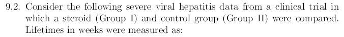
```
```{r}
knitr::include_graphics("92a.PNG")
```

```{r}
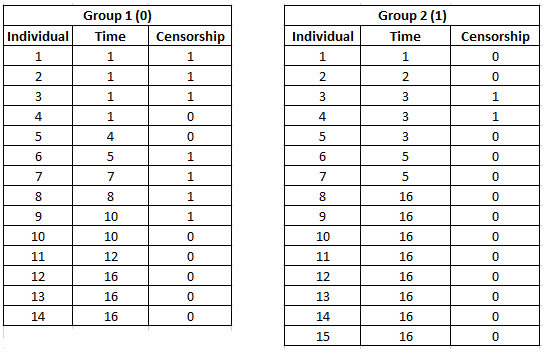
```

```{r}
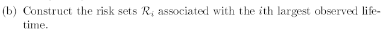
```
```{r}
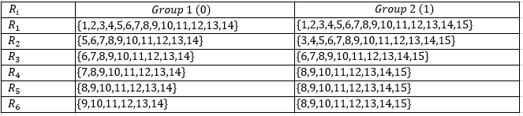
```

```{r}
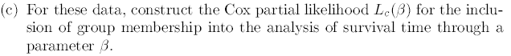
```
```{r}
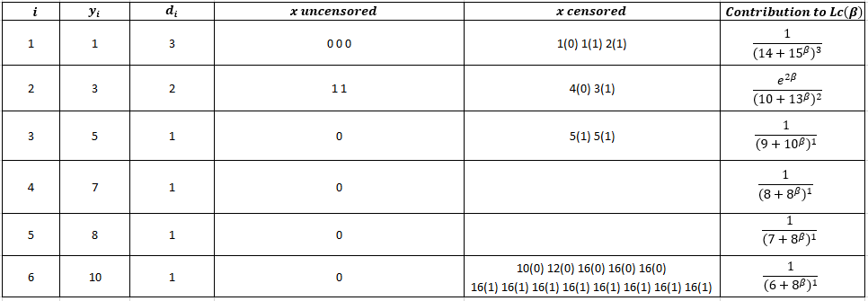
```


$$Lc\left(\beta \:\right)=\left[\frac{1}{\left(14+15^β\right)^3}\right]\left[\frac{e^{2β}}{\left(10+13^β\right)^2}\right]\left[\frac{1}{\left(9+10^β\right)^1}\right]\left[\frac{1}{\left(8+8^β\right)^1}\right]\left[\frac{1}{\left(7+8^β\right)^1}\right]\left[\frac{1}{\left(6+8^β\right)^1}\right]$$
Simplificando

$$Lc\left(\beta \:\right)=\frac{e^{2β}}{\left(15^β+14\right)^3\left(13^β+10\right)^2\left(10^β+9\right)\left(8^β+8\right)\left(8^β+7\right)\left(8^β+6\right)}$$

```{r}
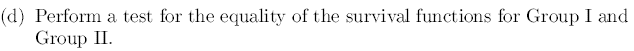
```
```{r}
hepatitis <- read.csv("hepatitis.csv", header = T, sep =",")
head(hepatitis)
```

```{r}

hepatitis$group <- as.factor(hepatitis$group)
hepatitis.fit <- coxph(Surv(hepatitis$time, hepatitis$cens) ~ hepatitis$group)

summary(hepatitis.fit)
```

```{r}
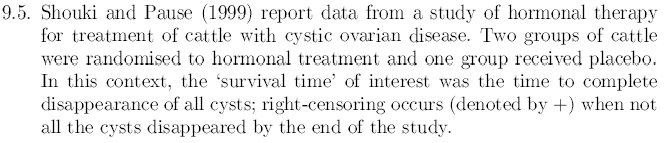
```
```{r}
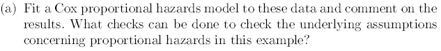
```


```{r}
cystic <- read.csv("cystic.csv", header = T, sep =",")
head(cystic)
```

```{r}

cystic$treatment <- as.factor(cystic$treatment)
cystic.fit <- coxph(Surv(cystic$time, cystic$cens) ~ cystic$treatment)

summary(cystic.fit)

```

```{r}
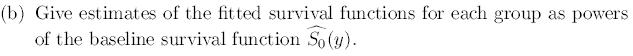
```

$$\hat{S}\left(t|x\right)=\left\{\begin{matrix}\hat{S_0}\left(t\right)^{exp\left\{-2.1132\right\}}\:&,\:si\:tratamiento\:2\:\\ \:\:\hat{S_0}\left(t\right)^{exp\left\{-4.6696\right\}}&,\:si\:tratamiento\:3\:\end{matrix}\right.$$

```{r}

H<-basehaz(cystic.fit,centered=F)
tpos<-H$time
H0<-H$hazard
S0<-exp(-H0)
round(cbind(tpos,S0,H0),digits=5)
```
```{r}
plot(tpos,S0^(exp(-2.1132)),ylim=c(0,1),type="l",xlab="Time",ylab="S(t|x)", col="blue")
lines(tpos,S0^(exp(-4.6696)), col="red")
legend("bottomleft", legend=c("Treatment 1", "Treatment 2"), col = c("blue","red"), lty = 1, bty = "n")
```

```{r}
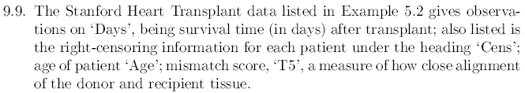
```
```{r}
heart <- read.csv("heart_data.csv", header= T, sep=";")
head(heart)
```

```{r}
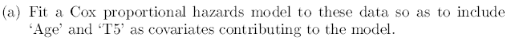
```

```{r}
cox.heart <- coxph(Surv(heart$Days,heart$Cens)~ heart$Age + heart$T5)
summary(cox.heart)
```


```{r}
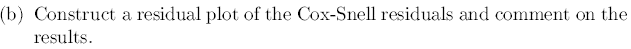
```

```{r}
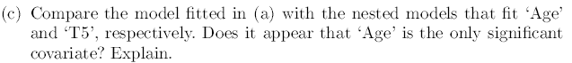
```

```{r}
cox.heart.age <- coxph(Surv(heart$Days,heart$Cens)~ heart$Age)
summary(cox.heart.age)
```

```{r}
cox.heart.T5 <- coxph(Surv(heart$Days,heart$Cens)~ heart$T5)
summary(cox.heart.T5)
```
