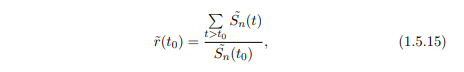
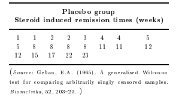
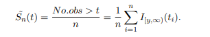
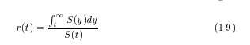

```{r}



```


```{r}

```


```{r}
time <- c(1,1,2,2,3,4,4,5,5,8,8,8,8,11,11,12,12,15,17,22,23)
rep <- c(1,2,3,4,5,8,11,12,15,17,22,23)
```

```{r}

```
Valores no repetidos

```{r}

St <- c()
for ( i in 1:length(rep)){
  
  St[i] <- sum(time > rep[i])
  
}

St <- St/21

plot(rep,St)
```

entonces

```{r}


```

```{r}
rt0 <- sum(St[-1])/St[1]
rt0
```
Mean residual time at age t

```{r}

```


```{r}
rt <- c()


for ( i in 1:12){
  
  rt[i] <- sum(St[-1:-i])/St[i]
  
}
rt
```

